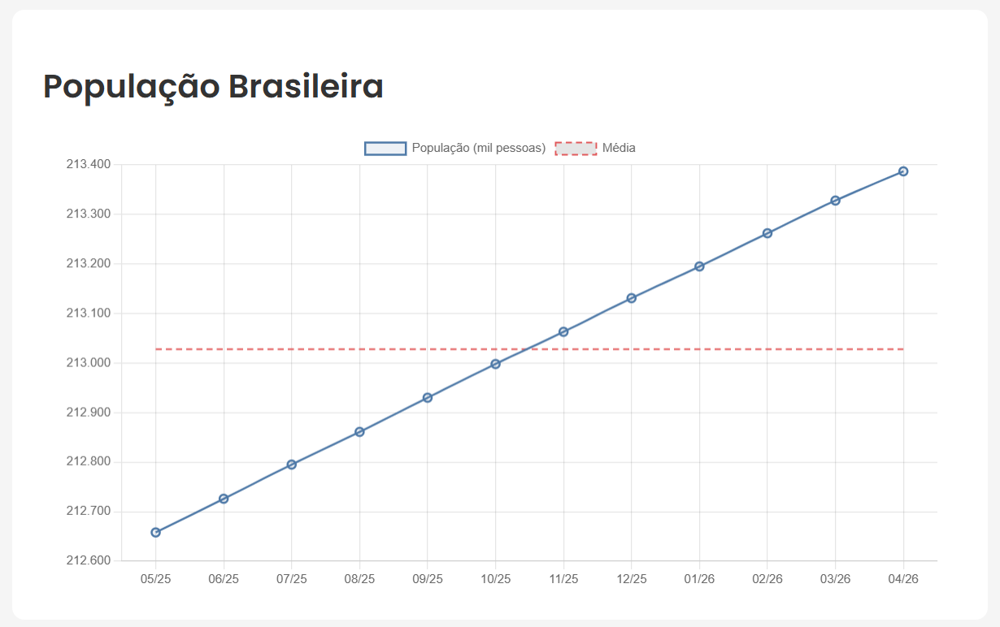

# 📊 IBGE Analytics

Pipeline de dados completo que extrai dados públicos do IBGE, armazena em PostgreSQL e exibe análises em dashboard web — tudo containerizado com Docker.


> *Substitua a imagem acima por um print do seu dashboard funcionando*

---

## Sobre o Projeto

Este projeto foi desenvolvido como laboratório de aprendizagem para dominar a stack de uma plataforma de analytics on-premise. A ideia foi replicar a arquitetura real de um sistema de People Analytics — com ETL, banco de dados relacional, API REST e frontend — usando dados públicos do IBGE como fonte.

A série utilizada é a **PNADC/M (Tabela 6022)** — População Total do Brasil, com dados mensais atualizados pelo IBGE.

**O que o projeto demonstra:**
- Construção de pipeline ETL completo em Python
- Containerização com Docker e orquestração via docker-compose
- API REST com FastAPI conectada ao PostgreSQL
- Dashboard web com Chart.js consumindo dados da API
- NGINX como reverse proxy roteando frontend e backend
- Boas práticas de segurança (credenciais em variáveis de ambiente, nunca no código)

---

## Stack Tecnológica

| Camada | Tecnologia |
|---|---|
| Containerização | Docker + docker-compose |
| Banco de dados | PostgreSQL 16 |
| ETL | Python + Requests + Psycopg2 |
| Backend | FastAPI + Uvicorn |
| Proxy reverso | NGINX |
| Frontend | HTML + Chart.js |
| Fonte de dados | API SIDRA/IBGE |

---

## Arquitetura

```
API IBGE (pública)
      ↓
ETL Python
(busca, transforma, insere)
      ↓
PostgreSQL
(armazenamento histórico)
      ↓
Backend FastAPI
(endpoints REST)
      ↓
NGINX
(proxy reverso)
      ↓
Frontend Chart.js
(dashboard web)
```

Todos os serviços rodam em containers Docker isolados e se comunicam pela rede interna do docker-compose.

---

## Estrutura do Projeto

```
projeto-ibge-analytics/
├── backend/
│   ├── Dockerfile
│   ├── main.py           # API FastAPI com endpoints
│   ├── .env              # credenciais (não versionado)
│   └── requirements.txt
├── etl/
│   ├── main.py           # ETL: extrai, transforma e insere
│   ├── .env              # credenciais (não versionado)
│   └── requirements.txt
├── frontend/
│   └── index.html        # Dashboard com Chart.js
├── nginx/
│   └── nginx.conf        # Configuração do proxy reverso
├── docker-compose.yml
├── .gitignore
└── README.md
```

---

## Como Rodar Localmente

### Pré-requisitos
- [Docker Desktop](https://www.docker.com/products/docker-desktop/) instalado e rodando

### 1. Clone o repositório

```bash
git clone https://github.com/seu-usuario/projeto-ibge-analytics.git
cd projeto-ibge-analytics
```

### 2. Configure as variáveis de ambiente

Crie um arquivo `.env` dentro das pastas `backend/` e `etl/` com o seguinte conteúdo:

```
DB_HOST=postgres
DB_PORT=5432
DB_NAME=ibge_analytics
DB_USER=seu_usuario
DB_PASSWORD=sua_senha
```

### 3. Suba os containers

```bash
docker compose up --build -d
```

### 4. Crie a tabela no banco

Conecte ao PostgreSQL (via DBeaver, pgAdmin ou SQLTools) usando as credenciais do `.env` e execute:

```sql
CREATE TABLE populacao (
  id              SERIAL PRIMARY KEY,
  periodo         VARCHAR(6)     NOT NULL,
  localidade      VARCHAR(100)   NOT NULL,
  valor           NUMERIC(12, 2) NOT NULL,
  unidade         VARCHAR(50),
  data_extracao   TIMESTAMP      DEFAULT NOW()
);
```

### 5. Execute o ETL

```bash
cd etl
venv\Scripts\activate   # Windows
source venv/bin/activate  # Linux/Mac
python main.py
```

### 6. Acesse o dashboard

Abra o navegador em:

```
http://localhost
```

---

## Endpoints da API

| Método | Endpoint | Descrição |
|---|---|---|
| GET | `/` | Status da API |
| GET | `/api/populacao` | Série histórica de população por período |

Documentação automática disponível em `http://localhost:8000/docs` (com o backend rodando diretamente via uvicorn).

---

## O que Aprendi

- Como estruturar um projeto de dados com separação clara de responsabilidades (ETL, banco, API, frontend)
- Como containerizar uma aplicação completa com Docker e docker-compose
- Como construir e expor uma API REST com FastAPI
- Como configurar NGINX como proxy reverso para servir frontend e backend por uma única URL
- Como aplicar boas práticas de segurança (variáveis de ambiente, .gitignore, sem credenciais no código)
- Como consumir uma API pública (IBGE/SIDRA) e transformar os dados para análise

---

## Contexto

Este projeto é um laboratório de aprendizagem desenvolvido em paralelo ao projeto profissional de **People Analytics** na [Vinci Airports no Brasil](https://vinci-airports.com/en/our-airports/brasil/), onde a mesma stack está sendo implementada para análise de dados de RH — com PostgreSQL on-premise, FastAPI, NGINX e autenticação via SAML/SSO com Microsoft Entra ID.

---

## Autor

**Wallace Praxedes**
People Analytics | Salvador Bahia Airports

[LinkedIn](https://www.linkedin.com/in/wallace-praxedes/) · [GitHub](https://github.com/wallace-praxedes)
